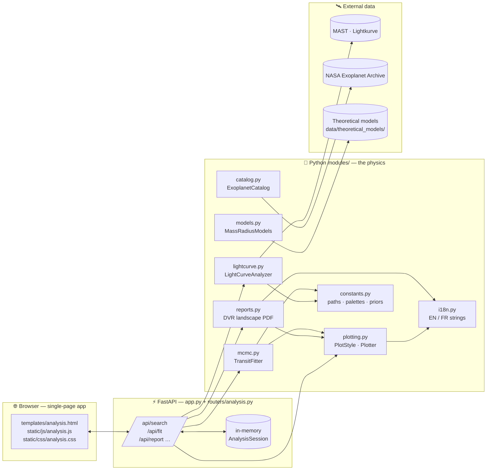

<!--
   ███████╗██╗  ██╗ ██████╗ ██████╗ ██╗      ██████╗ ████████╗
   ██╔════╝╚██╗██╔╝██╔═══██╗██╔══██╗██║     ██╔═══██╗╚══██╔══╝
   █████╗   ╚███╔╝ ██║   ██║██████╔╝██║     ██║   ██║   ██║
   ██╔══╝   ██╔██╗ ██║   ██║██╔═══╝ ██║     ██║   ██║   ██║
   ███████╗██╔╝ ██╗╚██████╔╝██║     ███████╗╚██████╔╝   ██║
   ╚══════╝╚═╝  ╚═╝ ╚═════╝ ╚═╝     ╚══════╝ ╚═════╝    ╚═╝
          A  quiet  workspace  for  loud  discoveries.
-->

<div align="center">


# &nbsp;Exoplot

### _Explore exoplanets visually — from raw photons to a publication-ready transit report._

<br/>

<p>
  
  
  
  
  
  
</p>

<p>
  <a href="#-quickstart"><b>Quickstart</b></a> &nbsp;·&nbsp;
  <a href="#-a-field-guide-to-exoplanets"><b>Science primer</b></a> &nbsp;·&nbsp;
  <a href="#-architecture"><b>Architecture</b></a> &nbsp;·&nbsp;
  <a href="#-the-physics-under-the-hood"><b>Models</b></a> &nbsp;·&nbsp;
  <a href="#-scientific-foundations"><b>Papers</b></a> &nbsp;·&nbsp;
  <a href="#-repository-map"><b>Repo map</b></a>
</p>

<sub>Made by <b>A. Wittmann</b> — CEA IRFU/DAp · Université Paris-Saclay</sub>

</div>

---

> <samp><b>For curious observers.</b>  Exoplot gathers NASA catalogs and Kepler / K2 / TESS light curves in one calm workspace. Type a star name, pick the sectors you trust, and watch a full transit analysis — detrending, BLS search, MCMC fit, and a landscape DVR PDF — unfold in your browser.</samp>

<br/>

<div align="center">

|  `◐`  Web workspace  |  `◑`  Python library  |  `◉`  Scientific report  |
|  :---:  |  :---:  |  :---:  |
|  FastAPI SPA — search MAST, fold transits, fit models.  |  Import `modules/` in a notebook; each stage is standalone.  |  Single-page landscape DVR PDF, publication-ready.  |

</div>

---

## &nbsp;`❖`&nbsp; What is this?

**Exoplot** is a small, self-contained scientific pipeline built at the **Université Paris-Saclay / CEA IRFU DAp**.
It turns a single user gesture — _"show me WASP-18"_ — into the full chain an exoplanet paper would take weeks to produce by hand:

```
   ┌─────────┐    ┌────────────┐    ┌─────────┐    ┌──────────┐    ┌─────────┐
   │  MAST   │ →  │ Lightkurve │ →  │   BLS   │ →  │   MCMC   │ →  │  DVR    │
   │ search  │    │  clean +   │    │ period  │    │  batman  │    │  PDF    │
   │ (TIC…)  │    │  stitch    │    │ search  │    │ + emcee  │    │ report  │
   └─────────┘    └────────────┘    └─────────┘    └──────────┘    └─────────┘
```

Behind the scenes it is a tiny **FastAPI** server serving a dark, animated single-page app (starfield canvas, KaTeX-rendered math, glass-morphism cards) that streams plots encoded in base64 and lets an MCMC job run on a background thread while the UI polls a progress bar.

There is **no database**, **no login**, **no cloud dependency** — every analysis lives in memory until you close the tab, and every figure is produced by open Python modules you can read, fork, or run in a notebook.

---

## &nbsp;`★`&nbsp; A Field Guide to Exoplanets

Before diving into the code, a short guided tour of the physics the pipeline is built around.

### What is an exoplanet?

An **exoplanet** (_extra-solar planet_) is any planet orbiting a star other than the Sun.
The first confirmed detection around a main-sequence star was **51 Pegasi b** in 1995 (Mayor & Queloz, Nobel Prize 2019).
As of 2026, **NASA's Exoplanet Archive** lists **≈ 5 800 confirmed worlds**, spanning hot Jupiters, lava super-Earths, Neptunian deserts, ocean worlds, and temperate rocky planets in their star's habitable zone.

They are detected through a handful of subtle signatures:

|  Method  |  What is measured  |  Strength  |
|  :---  |  :---  |  :---  |
|  **Transit photometry**  |  Tiny dips in stellar brightness when the planet crosses its star  |  Gives **radius** &nbsp;·&nbsp; bias-free at large distances  |
|  Radial velocity  |  Doppler wobble of the host star induced by the planet  |  Gives **minimum mass** `M · sin(i)`  |
|  Direct imaging  |  Coronagraphic pictures of the planet itself  |  Best for young, wide-orbit giants  |
|  Microlensing  |  Relativistic magnification by a foreground planet  |  Probes planets toward the Galactic bulge  |

> <b>Exoplot focuses on the transit method</b> — the one that produced the bulk of the Kepler and TESS harvest, and the one amenable to a clean, pedagogical pipeline.

### The transit: a planet's shadow on a pixel

When a planet passes in front of its star along our line of sight, it blocks a slice of starlight and the measured flux drops by a tiny fraction:

$$
\Delta F \;=\; \left(\frac{R_p}{R_\star}\right)^2
$$

For a Jupiter in front of the Sun that is about **1 %**. For an Earth it is **0.008 %** — the reason space photometry (Kepler, TESS, PLATO) is so essential.

A transit light curve looks like this:

```
   flux
   1.000 ────────╮              ╭────────────
                 │              │
                 │    transit   │     ← depth  δ ≈ (Rp/R★)²
   0.985         ╰──────────────╯
        ingress ← ─ ─ duration ─ ─ → egress
                             time
```

From a **well-sampled transit** four numbers can be extracted — and these four numbers are the core outputs of the Exoplot pipeline:

|  Symbol  |  Meaning  |  What it constrains  |
|  :---:  |  :---  |  :---  |
|  $R_p/R_\star$  |  Planet-to-star radius ratio  |  **Planet radius**  |
|  $a/R_\star$    |  Scaled orbital semi-major axis  |  **Stellar density**, orbital geometry  |
|  $i$            |  Orbital inclination  |  Whether the transit is central or grazing  |
|  $t_0$          |  Mid-transit time  |  **Ephemeris**, transit timing variations  |

### From light curve to science

A _light curve_ is the time series of a star's brightness. Kepler sampled **every 30 min** for 4 years; TESS samples **every 2 min** for 27-day sectors. A single star can accumulate **hundreds of thousands** of photometric points — and within that mountain of noise hides a planet, typically a **few-parts-in-ten-thousand** dip repeating every few days.

The art of transit photometry is therefore about:

- **Cleaning** — removing systematics, stellar variability, cosmic rays, and cadence gaps.
- **Searching** — phase-folding at every plausible period with a **Box-Least-Squares** (BLS) algorithm until the transit emerges as a sharp spike in the periodogram.
- **Folding** — stacking every transit on top of itself to average down noise.
- **Fitting** — matching an analytical transit shape (Mandel & Agol 2002; `batman`) to the folded curve, including **limb darkening** of the stellar disk.
- **Sampling** — running a **Monte-Carlo Markov Chain** (`emcee`) to propagate uncertainties onto _every_ derived parameter.

Exoplot automates all five stages end-to-end, in a single browser session.

---

## &nbsp;`◈`&nbsp; Features at a glance

<div align="center">

|  <samp><b>◐&nbsp;&nbsp;Visual catalog</b></samp>  |  <samp><b>◑&nbsp;&nbsp;Lightkurve search</b></samp>  |  <samp><b>◉&nbsp;&nbsp;Detrend + stitch</b></samp>  |
|  :---  |  :---  |  :---  |
|  Browse ~5 800 confirmed worlds from NEA, filter by discovery method, spectral type, mass–radius, eccentricity, habitability.  |  Query MAST for any TIC/KIC/EPIC/name. Pick sectors with ranges like `0-3,5,7`; the pipeline stitches them coherently.  |  SAP/PDCSAP normalisation, iterative σ-clipping, gap compression for display while preserving true cadence.  |

|  <samp><b>◎&nbsp;&nbsp;BLS period search</b></samp>  |  <samp><b>✦&nbsp;&nbsp;MCMC transit fit</b></samp>  |  <samp><b>❖&nbsp;&nbsp;DVR PDF report</b></samp>  |
|  :---  |  :---  |  :---  |
|  Kovács-style Box-Least-Squares with coarse→fine period grid; returns BLS periodogram, `P_best`, `t₀_best`.  |  `batman` transit model + `emcee` sampler with **DE** + **DE-Snooker** moves, Kipping-2013 LD priors, autocorrelation-based burn-in.  |  Single-page landscape A4 summary: raw LC, folded transit, TPF film strip, odd/even test, corner plot, derived parameters table.  |

|  <samp><b>⟡&nbsp;&nbsp;Mass–Radius overlays</b></samp>  |  <samp><b>✺&nbsp;&nbsp;Bilingual (EN/FR)</b></samp>  |  <samp><b>☾&nbsp;&nbsp;Dark + Light themes</b></samp>  |
|  :---  |  :---  |  :---  |
|  Overlay 40+ theoretical composition curves (Zeng, Lopez & Fortney, Marcus, Aguichine, Luo, Tang, Dorn).  |  Every UI string, PDF caption, axis label, and tooltip is translated through `modules/i18n.py`.  |  Theme toggle persists via `localStorage`; plots re-render with a palette-aware Matplotlib style.  |

</div>

---

## &nbsp;`⚙`&nbsp; Architecture

Exoplot is intentionally **flat, readable, and local-first**. Three layers; nothing else.



### The request lifecycle

1.  The browser loads `templates/base.html` (shared chrome: starfield canvas, glass header, theme toggle) and mounts `analysis.html`.
2.  The user types a target. The SPA calls `GET /api/search?target=…` — the server instantiates a `LightCurveAnalyzer`, queries **MAST**, and returns the search table.
3.  The user picks sectors (`"0-3,5"`). `POST /api/download` stitches them into one `clean_lc`.
4.  `POST /api/bls` runs Box-Least-Squares; the response carries a base64 periodogram plot and `P_best, t0_best`.
5.  `POST /api/fit` launches **MCMC in a background thread**. The UI polls `GET /api/fit/status` for `stage ∈ {preprocessing, sampling, done}` and a live progress bar.
6.  `GET /api/report` renders the **landscape DVR PDF** and serves it from `/results/…pdf`.

All plots are produced server-side with a Matplotlib `Agg` style that matches the DVR aesthetic — _serif + Computer-Modern mathtext, transparent background so UI cards show through, theme-aware palette, vibrant scientific colors_ (deep blue data, red model overlay).

---

## &nbsp;`🧠`&nbsp; The physics under the hood

### 1 · `LightCurveAnalyzer` — `modules/lightcurve.py`

The entry-point to MAST. Accepts rich index specs (`"0-5,7,9-15"`) so several sectors or quarters can be stitched into a single long baseline, maximising the number of transits available to BLS and MCMC.

<details>
<summary><b>What the cleaning actually does</b></summary>

- Loads raw SAP/PDCSAP flux through `lightkurve`.
- Iterative **5σ-clipping** on normalised flux (`LightCurve.remove_outliers`).
- Per-sector **normalisation** to unit median (so amplitude stitches cleanly).
- **Gap compression** in display-time only — true BJD cadence is preserved for the BLS/MCMC stages.
- Builds a `clean_lc` object that downstream modules consume blind to sector boundaries.
</details>

### 2 · `TransitFitter` — `modules/mcmc.py`

A careful implementation of the Mandel-Agol transit model inside an MCMC sampler, engineered to converge even on shallow or grazing transits.

<details>
<summary><b>Sampler design choices</b></summary>

- **Forward model:** `batman` (Kreidberg 2015) quadratic limb darkening, `exposure_time` matched to mission cadence.
- **Sampler:** `emcee` (Foreman-Mackey 2013) with a **50/50 mixture of `DEMove` + `DESnookerMove`** — robust to multi-modal posteriors and the LD ↔ impact-parameter degeneracy.
- **Warm-up:** `scipy.optimize.differential_evolution` → `minimize` to seed walkers near the MAP.
- **Priors:**
  - Uniform-in-bounds with **soft Gaussian walls** (no hard-wall rejections).
  - Weakly-informative Gaussian priors on limb-darkening coefficients — `u₁ ∼ 𝒩(0.35, 0.20)`, `u₂ ∼ 𝒩(0.22, 0.15)` — centred on Claret tables for F/G/K dwarfs.
  - Strict **Kipping 2013** inequalities enforced: `u₁ ≥ 0`, `u₁+u₂ ≤ 1`, `u₁+2u₂ ≥ 0`.
  - Geometric transit-existence check at every proposal.
- **Burn-in:** autocorrelation-based (`emcee`'s `get_autocorr_time`) — no hand-tuned cutoffs.
- **Parallelism:** `ProcessPoolExecutor` with a module-level log-prob so walkers pickle cleanly.
</details>

### 3 · `MassRadiusModels` — `modules/models.py`

A clean loader for the 40+ theoretical **mass–radius curves** shipped in `data/theoretical_models/`. Used by the catalog plotter to overlay composition tracks on the population scatter.

<details>
<summary><b>Models included</b></summary>

| Family | Reference | Regime |
|---|---|---|
| **Zeng 2016 / 2019** | [Zeng+ 2016](https://ui.adsabs.harvard.edu/abs/2016ApJ...819..127Z), [Zeng+ 2019](https://ui.adsabs.harvard.edu/abs/2019PNAS..116.9723Z) | Pure iron, pure rock, Earth-like, H₂O worlds, H₂ envelopes (0.1–5 %) on Earth-like cores at 300–2000 K |
| **Lopez & Fortney 2014** | [Lopez & Fortney 2014](https://ui.adsabs.harvard.edu/abs/2014ApJ...792....1L) | H/He-enveloped sub-Neptunes at 100 Myr / 1 Gyr / 10 Gyr, solar and enhanced metallicity |
| **Marcus 2010** | [Marcus+ 2010](https://ui.adsabs.harvard.edu/abs/2010ApJ...712L..73M) | Maximum collisional stripping boundary |
| **Aguichine 2021 / 2025** | [Aguichine+ 2021](https://ui.adsabs.harvard.edu/abs/2021ApJ...914...84A) | Irradiated ocean-world models |
| **Dorn (MR-Water20 650 K)** | [Dorn & Lichtenberg 2021](https://ui.adsabs.harvard.edu/abs/2021ApJ...922L...4D) | Steam atmospheres above rocky cores |
| **Luo 2024 · Tang 2025** | Recent updates | Revised interior structures |
</details>

### 4 · `ExoplanetCatalog` — `modules/catalog.py`

Method-chainable filtering of the **NASA Exoplanet Archive** CSV dump (`data/NEA_*.csv`). Automatically picks the most recent snapshot it can find. Exposes `.filter_stellar(...)`, `.filter_discovery(...)`, `.filter_spectral_type(...)`, `.reset()`, `.get_data()`.

### 5 · `reports.py` — the landscape DVR

A **Data-Validation-Report-style** single-page A4 landscape PDF, inspired by TESS QLP / SPOC reports, rebuilt from scratch in pure Matplotlib so every panel is reproducible:

```
┌──────────────────  EXOPLOT REPORT – <TARGET>  ──────────────────┐
│                       www.exoplot.fr                            │
│  Tmag: …  R★: …  Teff: …  Logg: …  M/H: …  ρ★: …                │
│  ┌──────────────────── Raw LC ────────────────────┬───────────┐ │
│  │                                                │  BLS PG   │ │
│  ├───────────────┬───────────────┬────────────────┤───────────┤ │
│  │ Folded transit│  Spaghetti    │   Fitted /     │           │ │
│  │  + residuals  ├───────────────┤   Derived /    │           │ │
│  │               │  TPF (mid)    │   Conv / Fit   │           │ │
│  ├───────────────┼───────────────┤   ─────────────┤           │ │
│  │  Odd / Even   │  Diff. img.   │      Corner plot           │ │
│  └───────────────┴───────────────┴────────────────────────────┘ │
│              Data generated : YYYY-MM-DD HH:MM                  │
└─────────────────────────────────────────────────────────────────┘
```

See the built-in examples — `results/WASP_18_DVR.pdf`, `results/WASP_76_DVR.pdf`.

---

## &nbsp;`📚`&nbsp; Scientific foundations

The pipeline is not a black box. Every stage has a reference you can read.

<table>
<tr><th align="left">Stage</th><th align="left">Foundational paper</th><th align="left">Tool</th></tr>
<tr><td><b>Transit geometry</b></td><td><a href="https://ui.adsabs.harvard.edu/abs/2002ApJ...580L.171M">Mandel & Agol 2002</a> — <i>Analytic light curves for planetary transit searches</i></td><td><code>batman</code></td></tr>
<tr><td><b>Transit model (implementation)</b></td><td><a href="https://ui.adsabs.harvard.edu/abs/2015PASP..127.1161K">Kreidberg 2015</a> — <i>batman: Basic Transit Model cAlculatioN</i></td><td><code>batman</code></td></tr>
<tr><td><b>Period search</b></td><td><a href="https://ui.adsabs.harvard.edu/abs/2002A%26A...391..369K">Kovács, Zucker & Mazeh 2002</a> — <i>A box-fitting algorithm</i></td><td><code>lightkurve.BoxLeastSquares</code></td></tr>
<tr><td><b>Limb darkening priors</b></td><td><a href="https://ui.adsabs.harvard.edu/abs/2013MNRAS.435.2152K">Kipping 2013</a> — <i>Efficient, uninformative sampling of limb-darkening coefficients</i></td><td><code>modules/mcmc.py</code></td></tr>
<tr><td><b>MCMC sampler</b></td><td><a href="https://ui.adsabs.harvard.edu/abs/2013PASP..125..306F">Foreman-Mackey+ 2013</a> — <i>emcee: The MCMC Hammer</i></td><td><code>emcee</code></td></tr>
<tr><td><b>Light-curve tooling</b></td><td><a href="https://ui.adsabs.harvard.edu/abs/2018ascl.soft12013L">Lightkurve collaboration 2018</a></td><td><code>lightkurve</code></td></tr>
<tr><td><b>Mass–radius — rocky</b></td><td><a href="https://ui.adsabs.harvard.edu/abs/2016ApJ...819..127Z">Zeng, Sasselov & Jacobsen 2016</a></td><td>Zeng tables</td></tr>
<tr><td><b>Mass–radius — H/He envelopes</b></td><td><a href="https://ui.adsabs.harvard.edu/abs/2014ApJ...792....1L">Lopez & Fortney 2014</a></td><td>L&amp;F tables</td></tr>
<tr><td><b>Mass–radius — ocean worlds</b></td><td><a href="https://ui.adsabs.harvard.edu/abs/2021ApJ...914...84A">Aguichine+ 2021</a></td><td>Aguichine tables</td></tr>
<tr><td><b>Collisional stripping</b></td><td><a href="https://ui.adsabs.harvard.edu/abs/2010ApJ...712L..73M">Marcus+ 2010</a></td><td>Marcus curve</td></tr>
<tr><td><b>Catalog</b></td><td><a href="https://exoplanetarchive.ipac.caltech.edu/">NASA Exoplanet Archive</a> (Akeson+ 2013)</td><td><code>data/NEA_*.csv</code></td></tr>
<tr><td><b>Missions</b></td><td>Kepler (Borucki+ 2010) · K2 (Howell+ 2014) · TESS (Ricker+ 2015)</td><td>via MAST</td></tr>
</table>

---

## &nbsp;`🚀`&nbsp; Quickstart

### Prerequisites

- **Python ≥ 3.11**
- A working **LaTeX** installation is _optional_ but recommended (for the crispest PDF typography). Otherwise the pipeline falls back to Matplotlib's `mathtext`.

### Install

```bash
git clone https://github.com/SimonWtmn/Exoplot.git
cd Exoplot

python -m venv exoplotvenv
source exoplotvenv/bin/activate            # Windows: exoplotvenv\Scripts\activate

pip install -r requirements.txt
```

### Launch the web workspace

```bash
python app.py
# → Uvicorn running on http://0.0.0.0:8000
```

Open <http://localhost:8000> — land on the hero page, click **Launch Lightcurve Analysis**, and try:

|  Target  |  What you will see  |
|  :---  |  :---  |
|  `WASP-18`    |  Textbook inflated hot Jupiter, strong transit, clean posterior.  |
|  `WASP-76`    |  Ultra-hot Jupiter with asymmetric ingress — a good fit-quality stress test.  |
|  `TIC 307210830`  |  Deep, short-period gas giant — BLS finds it instantly.  |

### Use the library from a notebook

```python
from modules.lightcurve import LightCurveAnalyzer
from modules.mcmc       import TransitFitter
from modules.reports    import build_dvr_pdf

lc = LightCurveAnalyzer("WASP-18")
lc.search().download(sectors="0-3,5").clean().stitch()

fit = TransitFitter(lc.clean_lc, period=lc.bls_best_period,
                                t0=lc.bls_best_t0)
fit.optimise().sample(n_walkers=64, n_steps=8000)

build_dvr_pdf(analyzer=lc, fitter=fit, out="results/WASP_18_DVR.pdf")
```

---

## &nbsp;`🗺`&nbsp; Repository map

```
Exoplot/
│
├── app.py                         ← FastAPI entry point (mounts static, routers, templates)
├── requirements.txt               ← pinned environment (Python 3.11+)
├── _smoke_test_report.py          ← end-to-end smoke test on a synthetic light curve
├── test_modules.ipynb             ← hands-on notebook tour of every module
│
├── modules/                       ← the science
│   ├── lightcurve.py              · MAST search · clean · stitch · BLS
│   ├── mcmc.py                    · batman + emcee transit fitter (DE moves, LD priors)
│   ├── catalog.py                 · NEA catalog filter (method-chainable)
│   ├── models.py                  · loader for theoretical M–R curves
│   ├── plotting.py                · PlotStyle · CatalogPlotter · TransitPlotter
│   ├── reports.py                 · landscape A4 DVR PDF builder
│   ├── constants.py               · palette · priors · paths · label maps
│   └── i18n.py                    · EN/FR strings for backend & PDF
│
├── routers/
│   └── analysis.py                ← JSON API consumed by the SPA (search → fit → report)
│
├── templates/                     ← Jinja2
│   ├── base.html                  · chrome + starfield canvas + theme toggle
│   ├── index.html                 · hero / about / cards
│   └── analysis.html              · 4-step SPA (Search → Select → Pipeline → Results)
│
├── static/
│   ├── css/                       · style.css · analysis.css (dark + light, glass UI)
│   ├── js/                        · main.js · analysis.js · i18n.js
│   └── images/logo.png
│
├── data/
│   ├── NEA_03042026.csv           ← NASA Exoplanet Archive snapshot
│   └── theoretical_models/        ← 40+ mass–radius tables (Zeng, L&F, Marcus, Aguichine…)
│
└── results/                       ← generated DVR PDFs land here
    ├── WASP_18_DVR.pdf
    ├── WASP_76_DVR.pdf
    └── _SMOKE_TEST.pdf
```

---

## &nbsp;`✶`&nbsp; Design principles

<table>
<tr>
<td width="33%" valign="top">

**◐ &nbsp;Local-first, no magic**

No database, no account, no telemetry. Every byte of state lives in one in-memory `AnalysisSession` dict; restart the server for a clean slate.

</td>
<td width="33%" valign="top">

**◑ &nbsp;One screen per idea**

The SPA is four steps: _Search → Select → Pipeline → Results_. The PDF is one landscape page. The repo has eight Python files. Readable scales.

</td>
<td width="33%" valign="top">

**◉ &nbsp;Reproducibility as a feature**

Every figure is a plain Matplotlib call. Every fit is driven by priors you can read in `constants.py`. Every catalog column has a human label in `constants.LABEL_MAP`.

</td>
</tr>
</table>

---

## &nbsp;`☉`&nbsp; Roadmap

- [ ] Multi-planet joint fits (currently single-planet per target)
- [ ] Radial-velocity upload to break the mass/inclination degeneracy
- [ ] GP systematics model (`celerite2`) for long-term stellar variability
- [ ] JWST / CHEOPS photometry ingestion
- [ ] Exportable HTML report alongside the PDF
- [ ] Docker image + pre-built `exoplot` CLI

---

## &nbsp;`☾`&nbsp; Credits

Built by **Simon Wittmann**, initially as part of an internship in the **CEA IRFU/DAp** of Paris-Saclay.

Huge thanks to the maintainers of
[**Lightkurve**](https://lightkurve.github.io/lightkurve/),
[**emcee**](https://emcee.readthedocs.io),
[**batman**](https://lkreidberg.github.io/batman/docs/html/index.html),
[**Astropy**](https://www.astropy.org),
[**FastAPI**](https://fastapi.tiangolo.com), and to the
[**NASA Exoplanet Archive**](https://exoplanetarchive.ipac.caltech.edu/) team
for making open planetary science possible.

Huge thanks to **Elsa Ducrot**, who helped me so much through my internship, and who kept showing interest into 

<sub>_Exoplot is a teaching / research project — not a substitute for mission pipelines. Verify any scientific claim against the original data and peer-reviewed tools._</sub>

---

<div align="center">

<sub>&nbsp;</sub>

**Exoplot** &nbsp;·&nbsp; _A quiet workspace for loud discoveries._

<a href="https://github.com/SimonWtmn/Exoplot">GitHub</a> &nbsp;·&nbsp;
<a href="https://exoplanetarchive.ipac.caltech.edu/">NASA Exoplanet Archive</a> &nbsp;·&nbsp;
<a href="https://lightkurve.github.io/lightkurve/">Lightkurve</a>

<sub>© 2026 — Made with care in Paris.</sub>

</div>
